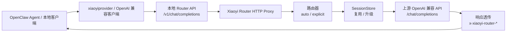
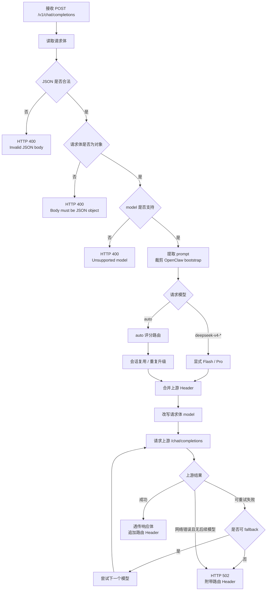
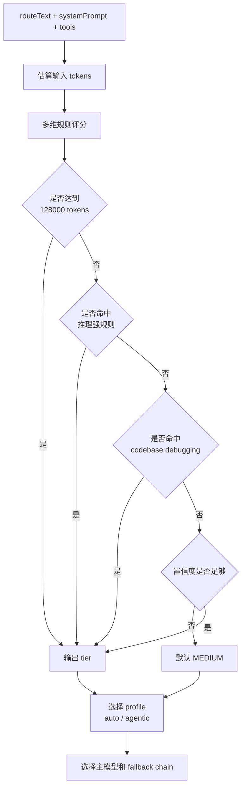
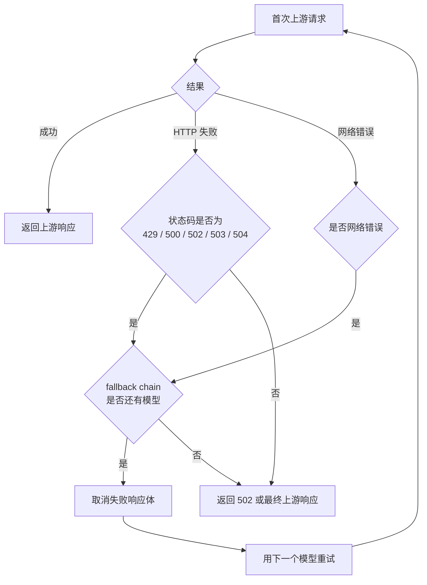
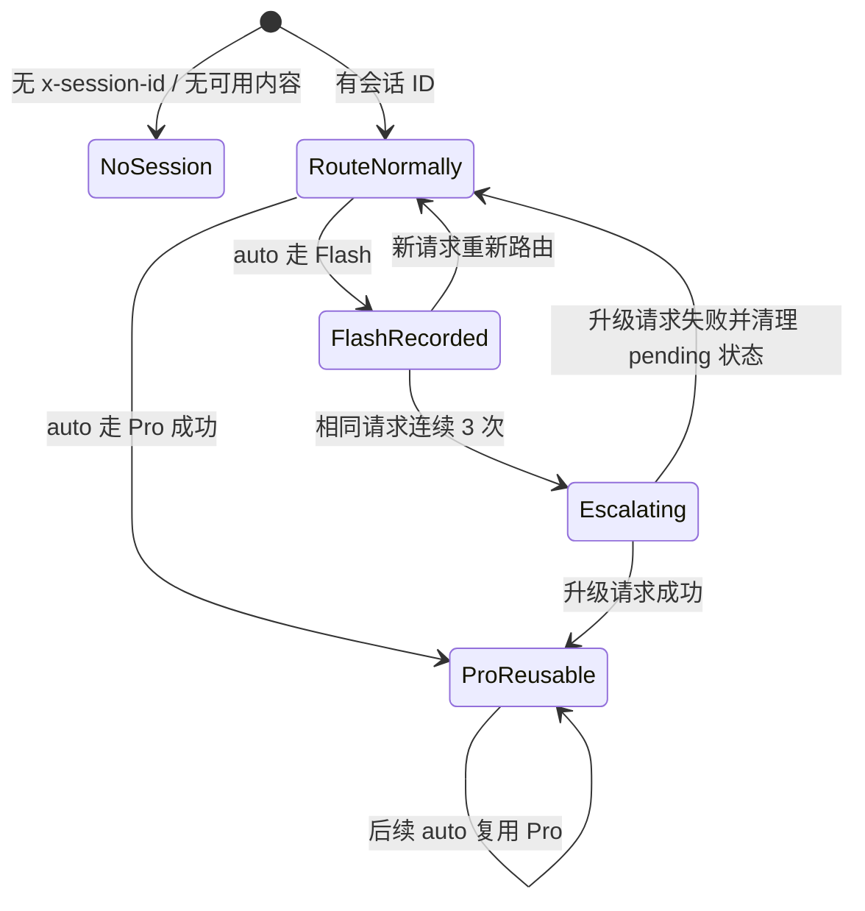

# Xiaoyi Router 总体设计方案

本文说明当前分支 `codex/xiaoyi-router-adapter` 中 `xiaoyi-router` 的系统定位、完整链路、核心设计、关键权衡、风险边界和验证方式。内容基于当前源码、测试、README、插件清单和开发文档复核整理。

## 1. 方案摘要

`xiaoyi-router` 是一个本地 OpenAI 兼容 Chat Completions 路由代理，也可以作为 OpenClaw 插件加载。它在本机暴露稳定的 `/v1/chat/completions` 入口，对外只提供 `auto`、`deepseek-v4-flash`、`deepseek-v4-pro` 3 个模型 ID，再由本地规则把 `auto` 请求路由到 Flash 或 Pro。

该方案适用于以下场景：

- OpenClaw 或本地客户端需要一个稳定的 OpenAI 兼容入口。
- 团队希望普通任务优先使用 Flash，复杂推理、调试、长上下文和高风险代码任务自动升级到 Pro。
- 团队可以接受基于规则与评分的本地路由，而不是每次都调用额外 LLM 做分类。
- 上游 API Key、`x-uid` 等鉴权与业务 Header 由环境变量、OpenClaw Provider 配置或请求 Header 管理，不由插件清单保存。

该方案不定位为通用多 Provider 网关。当前版本只实现必要链路：健康检查、Chat Completions 代理、模型路由、会话升级、fallback、OpenClaw 配置注入和路由观测。

## 2. 背景与目标

### 2.1 背景

OpenClaw 和本地 OpenAI 兼容客户端通常只关心一个模型入口，但真实上游可能存在成本、延迟和能力差异。全部请求都走强模型会带来成本浪费；全部请求都走轻模型又会影响复杂任务质量。`xiaoyi-router` 的设计目标是在客户端无感的前提下，把模型选择放到本地代理层完成。

### 2.2 核心目标

- 暴露一个小而稳定的本地 HTTP 服务，兼容 OpenAI Chat Completions 请求形态。
- 支持 `auto` 路由，把常规请求默认发往 Flash，把复杂请求发往 Pro。
- 支持显式模型请求，用户指定 Flash 或 Pro 时优先尊重用户选择。
- 兼容 OpenClaw 插件生命周期，通过 `registerService()` 启停本地代理。
- 写入或修复 `models.providers.xiaoyiprovider`，让 OpenClaw 的标准 `openai-completions` Provider 指向本地代理。
- 保留用户已有 `apiKey`、`api_key`、`headers`、`request.headers` 和未知字段。
- 提供响应头和可选日志 trace，支持排查最终路由、fallback 和上游地址。

### 2.3 非目标

- 不实现通用 OpenAI 代理的完整接口集。
- 不实现 `GET /v1/models`。
- 不注册 OpenClaw Provider，不在 `openclaw.plugin.json` 中声明 providers。
- 不管理真实 API Key，不改写 OpenClaw auth profile。
- 不实现缓存、钱包、x402、USDC、BlockRun、Solana 等能力。
- 不在当前版本实现可视化控制台或动态规则热更新。

## 3. 总体架构

系统由 7 个主要部分组成：

| 模块              | 主要职责                                                               |
| ----------------- | ---------------------------------------------------------------------- |
| CLI               | 解析 `--port`、`--base-url` 等参数，启动本地代理。                     |
| HTTP 代理         | 暴露 `GET /health` 和 `POST /v1/chat/completions`。                    |
| OpenClaw 插件     | 在 OpenClaw 启动时注册服务，并注入 Provider 配置。                     |
| Provider 配置注入 | 写入 `models.providers.xiaoyiprovider`，把 OpenClaw 请求导向本地代理。 |
| 路由器            | 对 `auto` 请求做规则评分、分层、profile 选择和模型选择。               |
| 会话存储          | 记录会话状态，复用 Pro 决策，并对重复失败倾向的 Flash 会话升级。       |
| 上游转发          | 合并 Header，改写 `model`，转发到上游 OpenAI 兼容 API。                |

完整链路如下：



需要特别区分两层 `baseUrl`：

| 名称                        | 用途                           | 示例                       |
| --------------------------- | ------------------------------ | -------------------------- |
| OpenClaw Provider `baseUrl` | 本地代理入口，由插件写入。     | `http://127.0.0.1:8402/v1` |
| 上游 API base               | 真正转发到的 OpenAI 兼容服务。 | `https://api.deepseek.com` |

上游 URL 计算固定为：


因此 `https://gateway.example.com/v1` 会转发到 `https://gateway.example.com/v1/chat/completions`。项目不会自动追加 `/v1` 或 `/v4`，也不会根据域名猜测 Provider。

## 4. 运行链路设计

### 4.1 启动链路

独立代理模式：

```mermaid
flowchart TD
  cli[运行 node dist/cli.js<br/>或 xiaoyi-router]
  args[解析 CLI 参数<br/>--port / --base-url]
  config[resolveConfig()<br/>合并入参与环境变量]
  start[startProxy()]
  listen[监听 127.0.0.1:port]
  close[关闭服务<br/>清理 SessionStore]

  cli --> args --> config --> start --> listen --> close
```

OpenClaw 插件模式：

```mermaid
flowchart TD
  load[OpenClaw 加载 dist/index.js]
  register[registerOpenClawPlugin(api)]
  runtimeConfig[解析 pluginConfig 与环境变量]
  inject[注入 / 修复<br/>models.providers.xiaoyiprovider]
  mode{registrationMode<br/>是否运行态}
  metadata[仅注入配置<br/>不启动代理]
  service[注册 xiaoyi-router-proxy 服务]
  start[service.start()<br/>启动本地代理]
  stop[service.stop()<br/>关闭本地代理]

  load --> register --> runtimeConfig --> inject --> mode
  mode -- discovery / metadata --> metadata
  mode -- runtime / active --> service --> start --> stop
```

`discovery`、`cli-metadata`、`setup-only`、`tool-discovery` 等注册模式只注入配置，不启动运行时代理，避免插件发现阶段误占端口。

### 4.2 请求处理链路

`POST /v1/chat/completions` 的处理步骤如下：



### 4.3 响应处理链路

代理不解析、不缓存、不重组上游响应。只要上游返回 `Response.body`，代理就逐块写入 Node.js `ServerResponse`。

响应 Header 处理规则：


当前响应 Header：

| Header                     | 含义                                                     |
| -------------------------- | -------------------------------------------------------- |
| `x-xiaoyi-router-model`    | 实际发往上游的模型。                                     |
| `x-xiaoyi-router-tier`     | 路由分层：`SIMPLE`、`MEDIUM`、`COMPLEX` 或 `REASONING`。 |
| `x-xiaoyi-router-trace`    | 紧凑路由摘要，例如 `auto:medium:flash:first-pass`。      |
| `x-xiaoyi-router-routed`   | 是否经过 `auto` 路由。                                   |
| `x-xiaoyi-router-fallback` | 是否使用了 fallback 后续模型。                           |
| `x-xiaoyi-router-upstream` | 当前代理配置的真实上游 API base。                        |

## 5. 路由策略设计

### 5.1 模型入口

对外只暴露 3 个模型：

| 模型 ID             | 定位                         | 用法                                       |
| ------------------- | ---------------------------- | ------------------------------------------ |
| `auto`              | 默认自动路由入口             | 本地选择 Flash 或 Pro。                    |
| `deepseek-v4-flash` | 低成本、低延迟模型           | 显式轻模型请求，失败时可 fallback 到 Pro。 |
| `deepseek-v4-pro`   | 复杂推理、调试和长上下文模型 | 显式强模型请求，不降级。                   |

显式模型请求不进入 `auto` 评分路由，但仍会经过代理的 Header 合并、上游转发、响应头追加和可重试处理。

### 5.2 评分分层

当前代理对 `auto` 请求使用 `route()`，底层策略为 `RulesStrategy`。它不是旧版「simple / code / complex 直接映射」模型，而是多维评分后映射到分层。



评分输入包括：

- 用户路由文本。
- system prompt。
- 估算输入 token 数，按 `(system + prompt).length / 4` 粗略估算。
- `max_tokens` 或 `max_completion_tokens`，缺省按 `1024` 估算。
- 请求是否包含工具。

主要评分维度包括：

- 输入长度。
- 代码关键词。
- 推理关键词。
- 技术关键词。
- 创意关键词。
- 简单任务关键词。
- 多步骤模式。
- 问题数量。
- 命令式动词。
- 约束数量。
- 输出格式要求。
- 引用上下文复杂度。
- 否定约束。
- 领域专有词。
- codebase debugging 任务。
- agentic 任务特征。

路由分层：

| Tier        | 默认主模型 | fallback |
| ----------- | ---------- | -------- |
| `SIMPLE`    | Flash      | 无       |
| `MEDIUM`    | Flash      | Pro      |
| `COMPLEX`   | Pro        | 无       |
| `REASONING` | Pro        | 无       |

关键规则：

- 估算输入达到 `128000` tokens 时强制 `COMPLEX`，走 Pro。
- 命中至少 2 个推理关键词时进入 `REASONING`，走 Pro。
- 明确的代码库调试、回归定位、测试失败修复链路进入 `COMPLEX`，走 Pro。
- 结构化输出不会直接强制 Pro，只会把低于 `MEDIUM` 的请求提升到 `MEDIUM`。
- 轻量 agentic 请求即使带工具，也可以保持 Flash；工具存在会影响 profile，但不是无条件 Pro 开关。
- 置信度不足时使用 `MEDIUM` 作为保守默认层。

### 5.3 Profile 选择

路由器支持 `auto`、`agentic`、`eco`、`premium` 等 profile 概念。当前代理默认使用自动 profile 选择，不向 HTTP API 暴露显式 profile 参数。

默认行为：

- 请求带工具，或 agentic 分数达到阈值时，使用 `agenticTiers`。
- 当前 `agenticTiers` 与默认 tiers 在模型映射上保持一致，但 trace 会标记为 `agentic`。
- `ecoTiers` 和 `premiumTiers` 保留在路由库能力中，当前代理未对外开放配置入口。

### 5.4 OpenClaw bootstrap 处理

OpenClaw CLI 请求可能把工具说明、历史上下文、系统约束和真实用户输入放在同一个较长消息中。如果直接对全文评分，`apply_patch`、文件路径、工具说明等内容可能把简单任务误判为复杂任务。

当前实现对用户消息应用方括号时间戳 / turn 格式提取规则，优先使用最后一段真实用户输入作为 `routeText`。完整消息仍用于请求转发，上游看到的请求体不被裁剪。

### 5.5 Fallback 策略

可重试状态码包括 `429`、`500`、`502`、`503` 和 `504`。fallback 决策如下：



策略：

- `SIMPLE` 默认没有 fallback。
- `MEDIUM` 默认 Flash，fallback 到 Pro。
- `COMPLEX` 和 `REASONING` 直接 Pro，无降级。
- 显式 Flash 请求也可以在可重试失败或网络错误时 fallback 到 Pro。
- 显式 Pro 请求不降级。
- fallback 前会尽力取消失败响应体，避免占用资源。
- fallback 成功后，`x-xiaoyi-router-fallback` 为 `true`，trace reason 为 `fallback`。

## 6. 会话策略设计

会话用于减少同一上下文内模型选择来回波动，并处理重复请求需要升级的场景。



### 6.1 会话 ID 来源

会话 ID 来源：

1. 优先读取 `x-session-id` Header。如果 Header 是数组，使用第一个非空值。
2. 没有 Header 时，提取第一条用户消息文本，规范化空白后做 SHA-256，截取前 8 位十六进制作为内容会话 ID。
3. 没有 Header 且没有用户文本时，不生成会话 ID。

### 6.2 Pro 复用与 Flash 记录

当前实现的核心原则是「复用 Pro，不复用普通 Flash 决策」：

- `auto` 请求实际走 Pro 且成功后，会写入可复用会话状态。
- 后续同一会话的 `auto` 请求会直接复用 Pro。
- `auto` 请求走 Flash 时，也会记录会话，用于重复请求计数和后续升级判断。
- 已记录的 Flash 会话不会直接作为「pin」复用；下一次仍会重新路由，除非触发重复请求升级。

这样设计可以避免一次简单任务把整个会话长期固定在 Flash，同时保留「同一请求反复出现可能说明 Flash 不足」的升级能力。

### 6.3 重复请求升级

会话记录会保存规范化后的请求哈希，哈希输入包括路由文本和工具名称。默认同一会话中相同请求连续出现 3 次时，尝试把会话升级到下一个可用 tier。

升级成功后：

- 会话模型和 tier 更新。
- `x-xiaoyi-router-trace` 的 reason 可体现为 `escalated`。
- 如果升级后的上游请求失败，会清理这次 pending escalation，避免把失败升级固定下来。

### 6.4 生命周期

默认会话 TTL 为 30 分钟，清理间隔为 5 分钟。代理关闭时会调用 `SessionStore.close()` 清理定时器。会话状态只在内存中保存，进程重启后丢失。

## 7. OpenClaw 集成设计

### 7.1 插件清单

`openclaw.plugin.json` 声明：

- 插件 ID：`xiaoyi-router`
- 入口：`./dist/index.js`
- 启动时激活：`activation.onStartup = true`
- 配置项：`port`、`upstreamUrl`

清单不声明 providers。这是为了兼容 OpenClaw v2026.4.11 和 v2026.3.24 等版本，避免 provider 注册行为与现有版本实现不一致。

### 7.2 配置注入

插件会确保存在：

```json
{
  "models": {
    "providers": {
      "xiaoyiprovider": {
        "baseUrl": "http://127.0.0.1:8402/v1",
        "api": "openai-completions",
        "models": ["auto", "deepseek-v4-flash", "deepseek-v4-pro"]
      }
    }
  }
}
```

注入原则：

- `models` 或 `providers` 不存在时创建对象。
- 保留现有 `apiKey`、`api_key`、`headers`、`request` 和未知字段。
- 始终修复 `baseUrl`、`api`、`models`。
- 不写入真实密钥。
- 可重复执行，不追加重复配置。

### 7.3 运行时配置透传

OpenClaw 服务启动代理时，会从 Provider 配置读取：

- `apiKey`
- `api_key`
- `headers`
- `request.headers`

Header 只接受字符串值。`request.headers` 会覆盖同名 `headers`。这让 `x-uid`、业务来源标识或上游鉴权 Header 可以由 OpenClaw 配置传入代理。

## 8. 配置设计

### 8.1 代理运行配置

| 配置项           | 优先级                                                              |
| ---------------- | ------------------------------------------------------------------- |
| `baseUrl`        | 函数入参 `baseUrl` > `XIAOYI_BASE_URL` > `https://api.deepseek.com` |
| `apiKey`         | 函数入参 `apiKey` > `XIAOYI_API_KEY`                                |
| `headers`        | `XIAOYI_ROUTER_HEADERS` 先合入，函数入参 `headers` 后覆盖           |
| `port`           | 函数入参 `port` > `XIAOYI_ROUTER_PORT` > `8402`                     |
| `defaultModel`   | 函数入参 `defaultModel` > `auto`                                    |
| `sessionPinning` | 函数入参 `sessionPinning` > `true`                                  |
| `traceMode`      | 函数入参 `traceMode` > `XIAOYI_ROUTER_TRACE` > `off`                |

### 8.2 插件运行配置

| 配置项        | 优先级                                                                          |
| ------------- | ------------------------------------------------------------------------------- |
| `port`        | `api.pluginConfig.port` > `XIAOYI_ROUTER_PORT` > `8402`                         |
| `upstreamUrl` | `api.pluginConfig.upstreamUrl` > `XIAOYI_BASE_URL` > `https://api.deepseek.com` |

无效端口会被忽略，并继续使用下一优先级来源。

## 9. 观测性设计

当前提供两类观测能力。

第一类是响应 Header。所有成功或代理层失败响应都会尽量包含 `x-xiaoyi-router-*` Header，便于调用方确认：

- 实际模型。
- tier。
- 是否 `auto` 路由。
- 是否 fallback。
- 当前上游 API base。
- 紧凑 trace 摘要。

第二类是可选日志 trace。通过 `XIAOYI_ROUTER_TRACE` 开启：

```bash
export XIAOYI_ROUTER_TRACE=summary
export XIAOYI_ROUTER_TRACE=debug
```

`summary` 输出一行简要日志。`debug` 输出结构化 JSON，包含 trace、实际模型、tier、profile、方法、置信度、得分、agentic 分数、尝试链路、会话动作和 prompt preview。prompt preview 只包含首尾片段，不输出完整 prompt。

## 10. 安全与隐私设计

- 插件清单不保存真实 API Key。
- README、使用手册和开发文档只使用占位符示例。
- 代理只在缺少 `Authorization` 且配置了 `apiKey` 时补充 Bearer Token。
- 自定义 Header 以大小写不敏感方式去重，配置 Header 覆盖请求 Header。
- hop-by-hop Header 不转发到上游。
- trace debug 只记录 prompt preview，不记录完整 prompt。
- 响应头中过滤上游伪造的本代理路由 Header，避免调用方被误导。

## 11. 测试设计

测试分为 5 类：

| 类型                 | 覆盖范围                                                                       |
| -------------------- | ------------------------------------------------------------------------------ |
| 模型与 Provider 测试 | 模型 ID、价格、能力、OpenClaw 模型定义。                                       |
| 路由测试             | 评分路由、agentic profile、长上下文、结构化输出、fallback chain、兼容 helper。 |
| 代理集成测试         | 本地 HTTP 服务、Header 合并、模型改写、fallback、流式透传、错误处理。          |
| 插件测试             | 配置注入、生命周期、启动失败、注册失败回滚、运行模式。                         |
| 包入口测试           | 构建后入口、npm metadata、OpenClaw manifest 与发布文件。                       |

当前测试不依赖真实上游 API Key。`test/proxy.test.ts` 会启动本地假上游和本地代理，验证端到端代理行为。

## 12. 方案收益

- 降低使用成本：普通请求优先走 Flash。
- 降低接入复杂度：客户端只需要面向 OpenAI 兼容接口调用。
- 保持人工可控：用户显式指定 Pro 时不降级，显式 Flash 时只在可重试失败时升级。
- 兼容 OpenClaw：不依赖不稳定 Provider 注册路径，使用配置注入接入标准 provider。
- 可排查：响应 Header 与 trace 能定位实际模型、fallback 和上游地址。
- 风险面较小：当前只实现必要 HTTP 接口，不引入缓存、支付、钱包等额外状态。

## 13. 主要风险与缓解

| 风险                           | 影响                                | 当前缓解                                                                                        |
| ------------------------------ | ----------------------------------- | ----------------------------------------------------------------------------------------------- |
| 规则路由误判                   | 简单任务走 Pro 或复杂任务走 Flash。 | 响应 Header 可观测；复杂调试、长上下文、推理关键词有强规则；可通过测试持续校准。                |
| OpenClaw 版本差异              | 插件注册或模型展示行为不一致。      | 不注册 provider，只修复 provider 配置；文档要求以 provider 配置、`/health` 和真实请求验证为准。 |
| 端口冲突                       | 插件服务启动失败。                  | 支持 `port` 配置和 `XIAOYI_ROUTER_PORT`；启动失败日志包含端口。                                 |
| 上游鉴权配置错误               | 请求返回 401 / 403。                | 支持请求 Header、Provider `apiKey`、`api_key` 和环境变量多来源。                                |
| fallback 掩盖 Flash 稳定性问题 | 调用成功但成本上升。                | 响应头标记 fallback，trace 记录尝试链路。                                                       |
| 进程内会话状态丢失             | 重启后失去 Pro 复用和重复升级记录。 | 当前作为可接受取舍；会话只用于优化，不作为强一致业务状态。                                      |
| 流式响应中途失败无法切换模型   | 长流式请求可能直接失败。            | 当前仅在收到可重试状态或网络错误时 fallback；文档明确边界。                                     |

## 14. 替代方案比较

| 方案                 | 优点                           | 缺点                                          | 结论                                     |
| -------------------- | ------------------------------ | --------------------------------------------- | ---------------------------------------- |
| 全部走 Pro           | 行为简单，质量稳定。           | 成本高，延迟高，无法体现 Flash 价值。         | 不推荐作为默认策略。                     |
| 全部走 Flash         | 成本低，延迟低。               | 复杂推理、调试、长上下文质量风险高。          | 只适合低风险场景。                       |
| 客户端手动选模型     | 控制权清晰。                   | 用户负担高，OpenClaw agent 场景难以稳定执行。 | 可保留显式模型入口，但不应作为唯一策略。 |
| 上游多 Provider 网关 | 能力完整，扩展空间大。         | 范围大，状态多，接入和排障成本高。            | 不适合当前 v0.1 目标。                   |
| 本地规则路由代理     | 小、可测、可观测，接入成本低。 | 规则需要持续校准。                            | 当前推荐方案。                           |

## 15. 落地验证

落地时按「受控验证」推进：

1. 在默认 OpenClaw Gateway 安装当前构建包。
2. 配置 `models.providers.xiaoyiprovider.apiKey` 和必要 Header。
3. 用 `/health`、直接 `curl` 和 OpenClaw agent 各验证一次链路。
4. 开启 `XIAOYI_ROUTER_TRACE=summary` 做短期观察。
5. 重点观察简单任务、代码任务、调试任务和长上下文任务的实际模型分布。
6. 当模型分布、fallback 比例和错误率符合预期后，再将 `xiaoyiprovider/auto` 作为默认模型入口使用。

上线前最低验证命令：

```bash
npm run typecheck
npm run lint
npm test
npm run build
npm pack --dry-run
```

## 16. 后续演进方向

- 路由规则配置化：允许不同团队按成本或质量偏好调整阈值。
- 更细粒度观测：暴露耗时、fallback 原因、会话命中、升级原因。
- OpenClaw 版本兼容矩阵：记录不同版本的插件生命周期和 provider 展示差异。
- 响应缓存：仅作为 Phase 2 候选，且必须区分 Flash / Pro、上游地址和关键生成参数。
- 流式失败处理：明确中途失败时的调用方体验和重试策略。
- e2e 验证脚本化：减少人工复制命令带来的误差。
